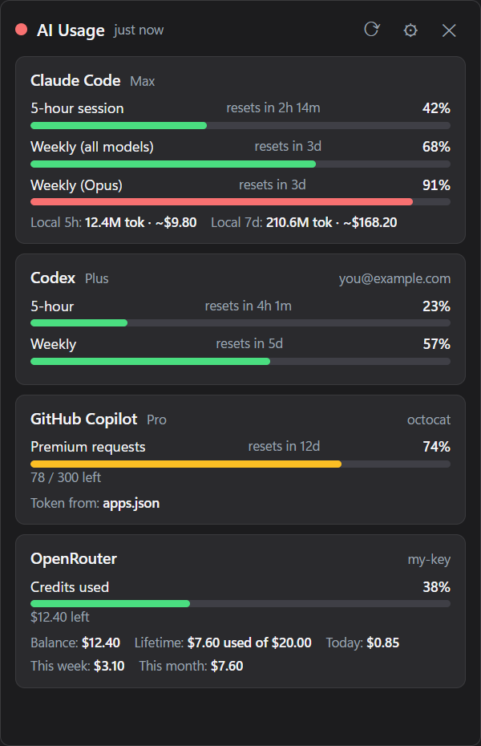

# AI Usage Tray

[](https://github.com/danglebz/ai-usage-tray-bar/actions/workflows/ci.yml)
[](https://github.com/danglebz/ai-usage-tray-bar/releases/latest)
[](LICENSE)

A small Windows tray app that puts the remaining quota and credits of your AI coding tools in one place: Claude Code, Codex CLI, GitHub Copilot, Gemini CLI, OpenRouter, and the Anthropic / OpenAI pay-as-you-go APIs.

Click the tray icon for a panel with one card per provider — used percentage, time until the window resets, credits left — and get a Windows notification once a limit crosses a threshold you choose.

<p align="center">
  
</p>

## Providers

| Provider                     | Shows                                                                                                | Auth comes from                                            | Status                                                                                                                                            |
| ---------------------------- | ---------------------------------------------------------------------------------------------------- | ---------------------------------------------------------- | ------------------------------------------------------------------------------------------------------------------------------------------------- |
| **Claude Code** (Pro / Max)  | 5-hour session %, weekly %, weekly per-model %, reset times; estimated tokens / cost from local logs | `~/.claude/.credentials.json`, written by Claude Code      | Verified                                                                                                                                          |
| **GitHub Copilot**           | Premium requests / chat / completions remaining                                                      | VS Code Copilot login, or `gh auth token`                  | Verified (Free plan)                                                                                                                              |
| **Codex CLI** (ChatGPT plan) | 5-hour %, weekly %, credits                                                                          | `~/.codex/auth.json`, written by Codex                     | Verified on a Free plan (single 30-day window); the Plus / Pro 5-hour + weekly pair has not been observed yet                                     |
| **Gemini CLI**               | Quota per model family                                                                               | `~/.gemini/oauth_creds.json`                               | Untested; Google stopped serving this path for individual / AI Pro / Ultra accounts on 2026-06-18 (Workspace and Code Assist accounts still work) |
| **OpenRouter**               | Credits left, per-key limit, daily / weekly / monthly spend                                          | API key entered in Settings                                | Official API                                                                                                                                      |
| **Anthropic API**            | Month-to-date spend, optional budget bar                                                             | **Admin** API key (`sk-ant-admin01-…`) entered in Settings | Needs an organization in the Anthropic Console; individual accounts cannot create Admin keys                                                      |
| **OpenAI API**               | Month-to-date spend, optional budget bar                                                             | **Admin** API key entered in Settings                      | Official API                                                                                                                                      |

Every provider can be switched off in Settings. A provider that fails shows its error on its own card; the others keep working.

## Install

### Portable exe

Download `AI.Usage.Tray.<version>.exe` from the [Releases](https://github.com/danglebz/ai-usage-tray-bar/releases) page and run it. It is not code-signed, so SmartScreen may warn on first launch — **More info → Run anyway**.

> **Smart App Control.** If Windows Security → App & browser control → Smart App Control is _enforced_ on your machine, it blocks unsigned executables outright: the portable exe starts, unpacks itself under `%TEMP%`, and the unpacked copy is killed. That is not the SmartScreen prompt you can click through. On such a machine run from source instead (below) — `electron.exe` carries enough reputation to be allowed.
>
> Check the state with `(Get-ItemProperty "HKLM:\SYSTEM\CurrentControlSet\Control\CI\Policy").VerifiedAndReputablePolicyState` — `0` off, `1` enforced, `2` evaluation. Turning Smart App Control off is permanent until Windows is reinstalled, so prefer running from source.

### From source

Requires [Node.js](https://nodejs.org) 22.18 or newer (24 recommended, see `.nvmrc`) and [pnpm](https://pnpm.io) (`corepack enable` is enough).

```sh
git clone https://github.com/danglebz/ai-usage-tray-bar.git
cd ai-usage-tray-bar
pnpm install      # also downloads the Electron binary
pnpm start
```

To launch without a terminal, double-click `Start AI Usage Tray.cmd` (or make a shortcut to it). It runs the app through Electron's own binary, which is what makes it work under Smart App Control.

## Using it

- **Left-click** the tray icon to open or close the panel; **right-click** for the menu (Refresh now, Start with Windows, Open config folder, Quit).
- In the panel: `R` refreshes, `S` opens Settings, `Esc` closes. ✕ closes the panel; quitting is in the tray menu and at the bottom of Settings.
- Settings apply as you change them — there is no Save button.
- **Notifications:** a Windows toast when any window reaches the threshold (default 90 %, `0` turns it off). Each limit is announced once per period: not again on every refresh, and not at all once it is already at 100 % — at that point there is nothing left to save.
- **Config** lives at `%APPDATA%\ai-usage-tray\config.json`. API keys are stored there in plain text, like the CLIs themselves do — keep the file to yourself.
- **Terminal probe** without the GUI: `pnpm probe`, or `pnpm probe claude codex` for a subset. Handy when a provider misbehaves.

The app maintains a Start Menu shortcut (`%APPDATA%\Microsoft\Windows\Start Menu\Programs\AI Usage Tray.lnk`) that carries its AppUserModelID; Windows uses it to show the app's name and logo on toasts. A copy of the logo is kept at `%APPDATA%\ai-usage-tray\toast-icon.png` and registered under `HKCU\Software\Classes\AppUserModelId\local.ai-usage-tray` as a fallback.

## Good to know

**The Claude / Codex / Copilot / Gemini endpoints are not public APIs.** They are the same endpoints each CLI calls for its own `/usage` display, found by reading the CLIs. When a vendor changes one, that card breaks until this app is updated; the source of each endpoint is documented at the top of its file under `src/providers/`.

**This app never refreshes anyone's token.** It only reads the credential files the CLIs write. Refresh tokens can be single-use, and refreshing on a CLI's behalf could log the CLI out. When a token has expired the card says so and asks you to open that CLI once.

**"Local 5h / 7d" on the Claude card is an estimate.** It sums tokens from `~/.claude/projects/**/*.jsonl` and multiplies by API list prices. It is not what Anthropic bills a subscription; use it to see how heavy your usage is. The percentages above it come from Anthropic.

## Development

There is no build step. Electron 44 embeds Node 24, which strips TypeScript type annotations at load time, so `src/main.ts` runs as-is — through `pnpm start`, the `.cmd` launcher and the packaged asar alike. The only constraint is [erasable syntax](https://www.typescriptlang.org/tsconfig/#erasableSyntaxOnly): no `enum`, `namespace` or parameter properties. Two files stay JavaScript on purpose: `src/preload.cjs` (a sandboxed preload is loaded by Electron's own script loader, not Node's) and `src/renderer/renderer.js` (Chromium cannot strip types). Both are type-checked through JSDoc against the same `src/types.ts`.

```sh
pnpm typecheck      # tsc, main process and renderer
pnpm lint           # eslint
pnpm format         # prettier --write
pnpm test           # vitest run (pnpm test:watch for watch mode)
pnpm verify         # all of the above, what CI runs
pnpm dist           # portable exe into dist/ (unsigned)
pnpm icon           # regenerate assets/icon.ico from assets/icon.png
pnpm screenshot     # re-render docs/screenshot.png from demo data
```

Debug aids: `AI_USAGE_DEBUG=1` logs notification decisions; `AI_USAGE_DEMO=1` replaces every provider with sample data (`src/demo.ts`) and mutes notifications, so the panel can be worked on without being logged in to anything; `AI_USAGE_SCREENSHOT=out.png pnpm start` opens the panel, saves a screenshot and quits (`AI_USAGE_SCREENSHOT_SETTINGS=1` for the Settings view).

### Layout

```
src/main.ts               Electron main: tray, popup, refresh loop, notifications, IPC
src/preload.cjs           contextBridge → window.api (sandboxed, CommonJS by necessity)
src/renderer/             the panel: vanilla JS + CSS, strict CSP, no framework
src/types.ts              the contract: Snapshot, Provider, AppConfig, Api
src/config.ts             config.json, defaults, dotted-path set
src/icon.ts               ring icon drawn from raw pixels (fallback when assets/ is missing)
src/cli.ts                terminal probe
src/demo.ts               sample results for AI_USAGE_DEMO
src/providers/_util.ts    fetch with timeout, JSON narrowing helpers, snapshot constructors
src/providers/*.ts        one file per provider, each exporting a Provider
scripts/make-icon.ts      builds assets/icon.ico
scripts/screenshot.ts     renders docs/screenshot.png (the README image) from demo data
```

### Adding a provider

1. Create `src/providers/<id>.ts` exporting a `Provider` (see `src/types.ts`): `id`, `name`, optional `help`, `needsConfig` for anything the user must enter, and `fetch(config)` returning a `Snapshot`. Use the `snap.*` constructors and `win()` from `_util.ts` so the shape is right, and start the file with a comment saying where the endpoint and field names come from.
2. Register it in `src/providers/index.ts` and add a default to `DEFAULTS.providers` in `src/config.ts`.
3. `pnpm probe <id>` until it looks right, then `pnpm verify`.

See [CONTRIBUTING.md](CONTRIBUTING.md) for the rest.

## Releasing

Versions come from the commits. [release-please](https://github.com/googleapis/release-please) reads the [Conventional Commits](https://www.conventionalcommits.org/) on `main` and keeps a **release PR** open with the next version number, the `package.json` bump and the [CHANGELOG.md](CHANGELOG.md) entry it derived. Merging that PR tags the version, publishes the GitHub Release, and builds the portable exe onto it.

So there is nothing to run by hand: write `feat:` and `fix:` commits, and merge the release PR when the next version should go out. While the project is pre-1.0, `feat:` bumps the patch and a breaking change bumps the minor.

Only `feat`, `fix`, `perf`, `revert`, `build` and `refactor` commits reach the changelog; `ci`, `docs`, `test` and `chore` are kept out of it. A run of those alone produces no release PR, which is the intended outcome — nothing a user would notice has changed.

Any type that reaches the changelog also counts towards a release, `build` included — so a batch of Dependabot merges is enough to open a release PR on its own. That is deliberate: the exe carries its own Electron and Chromium, so a dependency bump is how a security fix reaches anyone, and it should be able to ship without waiting for an unrelated feature. It does not make releases noisy, because the PR only accumulates until someone merges it.

`release.yml` stays for the manual path: pushing a `v*` tag yourself, or running the workflow from the Actions tab against an existing tag to rebuild its exe. It refuses to run if the tag and `package.json` disagree.

## License

[MIT](LICENSE)
